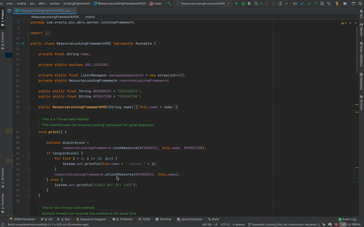

# Simple-Distributed-Locking-Library-in-Java

When multiple processes / threads try to access and modify a shared resources we may end up in an inconsistent state. To avoid that we make use of something known as distributed locking in which we acquire a lock on a particular resource by adding a database entry and only the process which holds the lock is allowed to enter the critical code. The locking framework has to be concurrency proof - meaning, even if multiple processes are trying to modify a resource at the same time, it should let only one process hold the lock at a time.

Now, you may think why we need a distributed locking library to achieve this, why not use the ``synchronized`` keyword provided by Java JDK. Well, when we work in a large services we use multiple machines that coordinate with each other to return a successful result. Now, each of this machine has their own JVM and so the synchronized block in one machine has no information about the code running in other machines. The other machines still think that there is only one process working with a synchronized piece of code. Syncrhonized keyword's scope is limited to that particular VM's JVM. Whereas since our simple distributed locking library uses a shared database for storing the locks this problem gets resolved. 

---
**NOTE**

This code does not contain all the required dependent files but has enough to understand the distributed locking libary's user interface APIs. The files which are missing have some code from my work projects which I cannot upload.

---

## Features of the simple distributed locking library:

1. The library provides a simple interface to developers who want to lock their resources by creating a database locks. lockResource() and unlockResource() are the only two methods that you need to know about to work with this library!
2. You can easily configure the timeout limit for acquiring a lock and also decide the retry time to acquire a lock as per your needs.

## Demo

First lets see what happens if we don't use a distributed locking library and then later we will see how we can solve that problem using the simple distributed locking library.  

### Without locking
When multiple processes try to modify the same resource at the same time, each process may end up stepping on other process' foot. In the below animation you can see various threads getting overlapped with each other due to absence of a locking mechanism

### With locking
When we use the simple distributed locking library we can see that only one process is getting executed at a time.
The general for each process goes like this

1. Acquire a lock on the resources using ``lockResource()`` method
2. Excute critical code section
3. Release the lock on the resource using ``unlockResource()`` method

